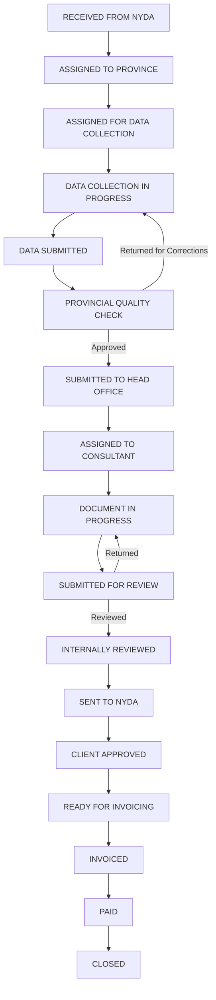

# Tshira Workflow Management System — User & Reference Manual

Welcome to the official User & Reference Manual for the **Tshira Workflow Management System**. This system is engineered to coordinate and streamline cases, client engagements, financial invoicing (billing), resource requisitions, and operational expense reporting across provincial boundaries.

---

## 📂 Table of Contents
1. [System Roles & Permissions](#1-system-roles--permissions)
2. [Workflow Lifecycle](#2-workflow-lifecycle)
3. [Requisitions (Space Bookings) vs. Expenses](#3-requisitions-space-bookings-vs-expenses)
4. [Billing & Invoicing Guide](#4-billing--invoicing-guide)
5. [System Settings & Adjustments](#5-system-settings--adjustments)

---

## 1. System Roles & Permissions
The system coordinates action among several discrete user roles:
* **Super Admin (`ADMIN_OFFICER`):** Full system visibility. Can assign Provincial Coordinators, create cases, adjust settings, manage team accounts, and override any workflow status.
* **Provincial Coordinator (`PROVINCIAL_COORDINATOR`):** Manages work within their designated province. Assigns field officers (DCOs), performs provincial quality checks, and manages local space requisitions.
* **Data Collection Officer (`DATA_COLLECTION_OFFICER` / DCO):** Conducts physical field data collection, completes questionnaires, and submits verified raw client data.
* **Business Consultant (`BUSINESS_CONSULTANT`):** Develops business plans, feasibility studies, or required structural documents based on completed data collection.
* **Reviewer (`REVIEWER`):** Conducts strict internal quality check of completed documents before they are submitted to NYDA.
* **Finance (`FINANCE`):** Manages invoice generation, delivery to clients, receipt tracking, and expense reimbursements.

---

## 2. Workflow Lifecycle
The workflow advances sequentially through the following discrete stages:

---

## 3. Requisitions (Space Bookings) vs. Expenses
There is a fundamental functional and financial distinction between a **Requisition** and an **Expense**:

| Feature | 🗓️ Requisition (Space Booking) | 🧾 Expense (Reimbursement Claim) |
| :--- | :--- | :--- |
| **Phase** | **Pre-Action** (Before spending/action occurs) | **Post-Action** (After spending occurs) |
| **Operational Goal** | Securing permission and booking a workspace/venue or scheduling a physical field visit with a client. | Claiming reimbursement for actual out-of-pocket costs incurred during work. |
| **Budgeting State** | Estimated budget allocation. No real cash is paid out yet. | Actual paid expense requiring direct financial reimbursement. |
| **Required Proof** | Location, purpose, scheduled date/time, and client details (if a client visit). | Exact numerical amount, description, and an uploaded physical **Receipt/Proof of Payment**. |
| **Approval Flow** | `DRAFT` ➔ `SUBMITTED` ➔ `APPROVED` ➔ `BOOKED` ➔ `COMPLETED` | `PENDING` ➔ `APPROVED` or `REJECTED` |

### Detailed Comparison:

#### 🗓️ Requisitions (Space Bookings)
* **What it is:** A booking and coordination tool. Before you travel to meet a client or conduct field interviews, you submit a Requisition to reserve a co-working space (e.g., Regus Polokwane) or request clearance for a client meeting.
* **How it works:** 
  1. Click **Requisitions** ➔ **New Requisition** (Space Booking).
  2. Input the Location, scheduled Date, Purpose, and link the specific Client you are meeting.
  3. Enter an *estimated* cost for the booking or trip.
  4. Submit. The system notifies Head Office/Finance. Once approved, the booking status changes to `APPROVED`, and you are cleared to proceed with the trip.

#### 🧾 Expenses (Claims)
* **What it is:** A financial refund mechanism. Once you have traveled, conducted the meeting, or printed documents, you submit an Expense to get refunded for the actual cash you spent.
* **How it works:**
  1. Click **Expenses** ➔ **Add Expense**.
  2. Link the expense to the specific Case/Project.
  3. Input the **exact actual amount** spent and select the appropriate category (e.g., `TRAVEL`, `MEALS`, `PRINTING`, `ACCOMMODATION`).
  4. Upload an image or PDF of the physical receipt (**Proof of Payment**).
  5. Submit. Finance reviews the proof and refunds your claim.

---

## 4. Billing & Invoicing Guide
The **Billing** tab houses the primary **Billing Tracker** and **Billing Queue** for all completed deliverables.

### Invoicing Rules:
1. **Completion Check:** Invoices can **only** be generated for cases that have a finalized status of **`CLIENT_APPROVED`** or **`READY_FOR_INVOICING`**.
2. **Work-in-Progress (WIP) Lockdown:** Any case that is still in earlier production phases will show a `Work In Progress` badge under actions, making it impossible to prematurely or accidentally invoice a client before work is certified complete.
3. **Sequential numbering:** The system auto-generates sequential, unique invoice numbers (e.g. `TSH-0004`) based on your organization settings.

### To Generate an Invoice:
1. Navigate to the **Billing** tab.
2. Locate the case under the **Billing Queue** (which must be marked `CLIENT_APPROVED` or `READY_FOR_INVOICING`).
3. Click **Generate Invoice**.
4. The high-visibility centered Modal will appear. Enter the final **Amount (ZAR)** and click **Save & Mark Invoiced**.
5. Once saved, you can print, download as A4 PDF, email, or share the invoice link directly with the client.

---

## 5. System Settings & Adjustments
Super Admins can configure global system details under **Settings**:
* **Company Profile:** Set the organization name, contact email, phone number, physical address, and logo.
* **Banking Details:** Set the Bank Name, Account Number, Branch Code, Account Type, and VAT number which will automatically populate on every printed invoice.
* **Billing Details:** Adjust the invoice sequential counter, prefix (e.g. `TSH`), and payment terms.
